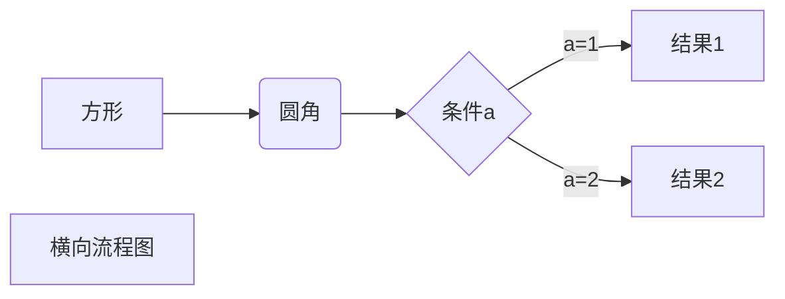
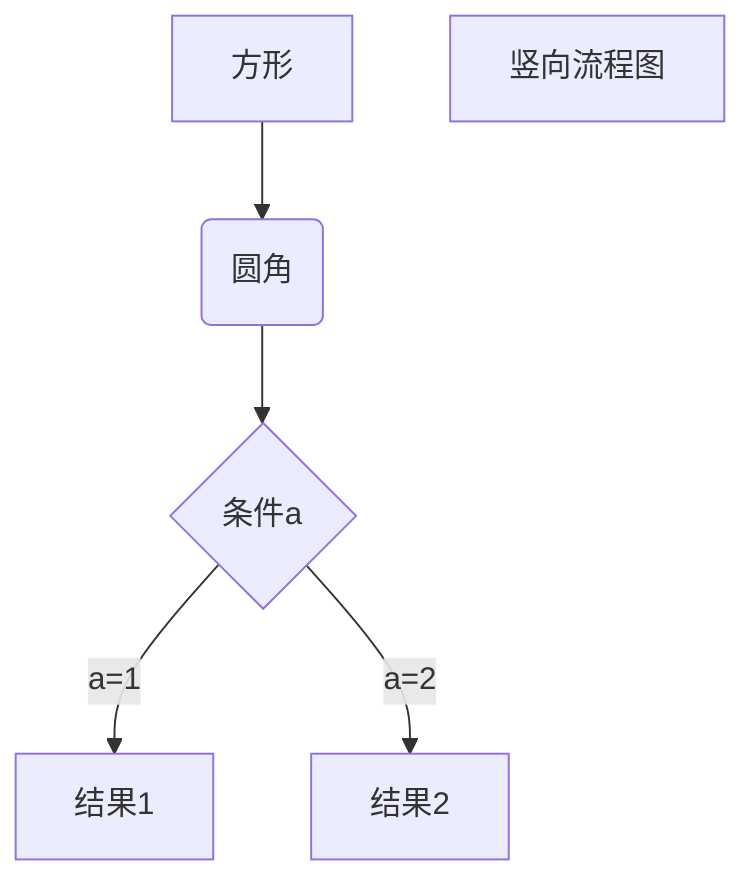
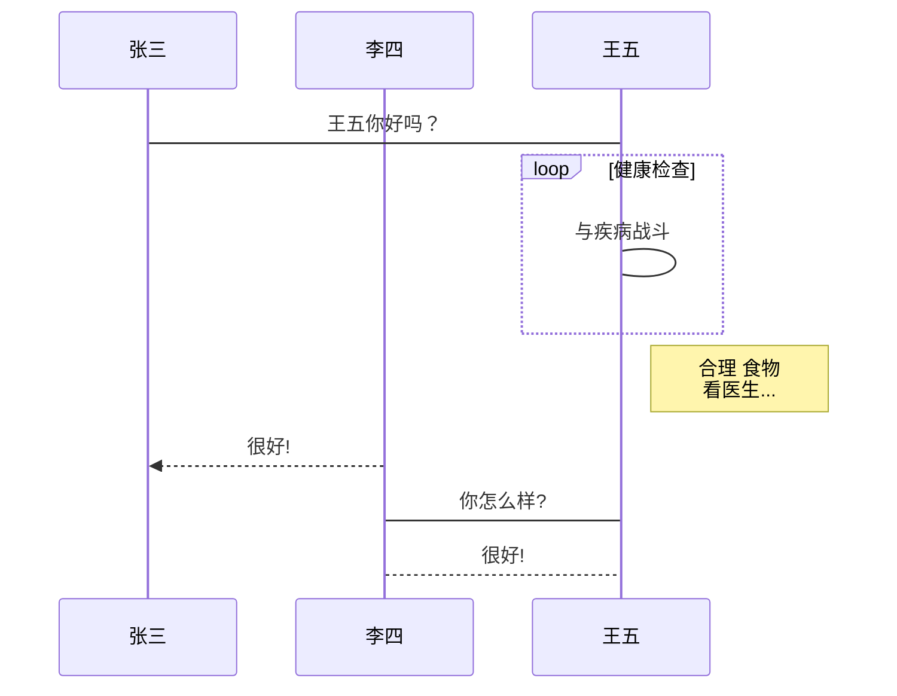
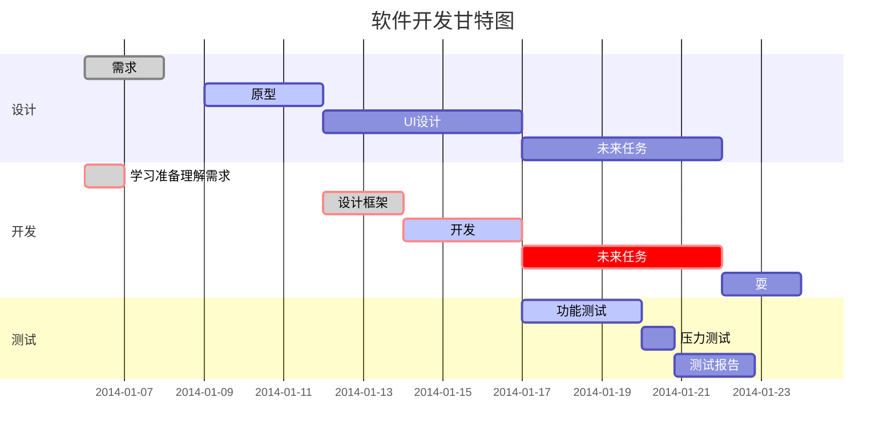

MarkDown是一种通过使用特定字符来让文本产生变化的语法，通过学习MarkDown的语法，通过可以解析文本中含有MarkDown语言的应用，让文本产生变化效果，适合快速做笔记。
<!-- more -->

# MarkDown
## 标题

1. 在文字前加“#”，#越多标题越小，一共有六级标题
2. 一级标题可以在文字下加“=”，二级标题可以在文字下加“-”
```
# 标题名
##### 标题名
一级标题
===========
二级标题
-----------
```
## 段落

换行：是使用两个以上空格加上回车。
分割线：在一行中用三个以上的星号、减号、底线来建立一个分隔线，行内不能有其他东西，但在星号或是减号中间可以插入空格。

```
***
*******
* * * *
- - - -
-------
```
## 文本
```
*斜体文本*
_斜体文本_
**粗体文本**
__粗体文本__
***粗斜体文本***
___粗斜体文本___
脚注：[^要注明的文本]
删除线：~~BAIDU.COM~~
下划线：<u>带下划线文本</u>
Markdown支持HTML元素，支持的 HTML 元素有：<kbd> <b> <i> <em> <sup> <sub> <br>等
Markdown 使用了很多特殊符号来表示特定的意义，如果需要显示特定的符号则需要使用转义字符，Markdown 使用反斜杠转义特殊字符：
**文本加粗** 
\*\* 正常显示星号 \*\*
```
## 链接
```
普通链接：
[链接名称](链接地址)
<链接地址>

高级链接：
这个链接用 1 作为网址变量 [Google][1]
这个链接用 runoob 作为网址变量 [Runoob][runoob]
然后在文档的结尾为变量赋值（网址）

[1]: http://www.google.com/
[runoob]: http://www.runoob.com/
```

## 图片
```
普通格式：


高级格式：
这个链接用 1 作为网址变量 [RUNOOB][1].
然后在文档的结尾为变量赋值（网址）

[1]: https://static.jyshare.com/images/runoob-logo.png

使用html的设置图片高和宽：

```


在markdown中，可不可以对于一个图片，设置两个图片源？
在 Markdown 中，标准语法并不支持为单个图片设置多个图片源。
1. 你可以通过 HTML 来实现这种效果，利用 `<picture>` 标签来指定多个图片源，这在响应式设计中很常见。
```html
<picture>
  <source srcset="image1.jpg" media="(min-width: 800px)">
  <source srcset="image2.jpg" media="(max-width: 799px)">
  
</picture>
```
在这个例子中，浏览器会根据屏幕宽度来选择合适的图片。如果屏幕宽度大于等于800px，则加载 `image1.jpg`；如果小于800px，则加载 `image2.jpg`。 `default.jpg` 是默认加载的图片。

我想为一个图片设置两个图片源，一个是我的图床链接，一个是我本地图片链接，这样我用的时候，当图床打不开，就可以使用本地连接打开，可以做到吗？

2. 通过 JavaScript 检测图床图片加载是否失败，失败时自动加载本地图片。

在这个例子中，`onerror` 属性用于检测当图床图片加载失败时，自动将 `src` 设置为本地图片链接。


对于图片：
1. 使用图床
在任意设备上都可以察看笔记，不用同步图片
2. 本地：
不用每次都加载，论文笔记带有大量图片，每次估计还挺慢的

要是能自由切换就好了，当本地有图片时就用本地的，没有的话就从网络中加载。做一个图片池？解决这个问题？


## 列表


```
无序列表
* 第一项
+ 第二项
- 第三项

有序列表
1. 第一项
2. 第二项
3. 第三项

列表嵌套
1. 第一项：
    - 第一项嵌套的第一个元素
    - 第一项嵌套的第二个元素
2. 第二项：
    - 第二项嵌套的第一个元素
    - 第二项嵌套的第二个元素
```

## 区块
```
> 区块
> > 区块可以嵌套使用
> > > 3. 区块可以和有序列表一起使用
> > > > + 区块可以和无序列表一起使用
+ 无序列表
	> 要将区块放在列表下，需要在">"前添加四个空格的缩进
```

## 表格

```
一般格式：
|  表头   | 表头  |
|  ----  | ----  |
| 单元格  | 单元格 |
| 单元格  | 单元格 |

设置对齐：
| 左对齐 | 右对齐 | 居中对齐 |
| :-----| ----: | :----: |
| 单元格 | 单元格 | 单元格 |
| 单元格 | 单元格 | 单元格 |
```

## 公式
```
$...$ 或者 \(...\) 中的数学表达式将会在行内显示。
$$...$$ 或者 \[...\] 或者 ```math 中的数学表达式将会在块内显示。

```

## 代码块
1. 行内`代码`片段
2. 代码区块：
```
a.代码前使用 4 个空格或者一个制表符（Tab 键）
	int main(){
		printf("HelloWorld!");
	};
b.代码区块前后用```包裹
```
## frontmatter
是一种写在 Markdown 文件开头的**YAML 格式的区块**，用来给页面提供元数据（metadata），也叫**页面配置项**。
在 Markdown 文件最上面用 `---` 包住一段信息，告诉 VuePress 这个页面的一些“属性”，比如标题、描述、分类、是否显示导航栏、是否在侧边栏中显示等等。
例如：
```markdown
---
title: 我的页面标题
description: 这是这个页面的描述
author: Betty
date: 2025-06-10
tags:
  - VuePress
  - 前端
sidebar: false
---

# 正文开始
这里是正文内容……

```


## Markdown高级技巧演示

1、横向流程图源码格式：


2、竖向流程图源码格式：


3、标准流程图源码格式：

```flow
st=>start: 开始框
op=>operation: 处理框
cond=>condition: 判断框(是或否?)
sub1=>subroutine: 子流程
io=>inputoutput: 输入输出框
e=>end: 结束框
st->op->cond
cond(yes)->io->e
cond(no)->sub1(right)->op
```
4、标准流程图源码格式（横向）：

```flow
st=>start: 开始框
op=>operation: 处理框
cond=>condition: 判断框(是或否?)
sub1=>subroutine: 子流程
io=>inputoutput: 输入输出框
e=>end: 结束框
st(right)->op(right)->cond
cond(yes)->io(bottom)->e
cond(no)->sub1(right)->op
```
5、UML时序图源码样例：

```sequence
对象A->对象B: 对象B你好吗?（请求）
Note right of 对象B: 对象B的描述
Note left of 对象A: 对象A的描述(提示)
对象B-->对象A: 我很好(响应)
对象A->对象B: 你真的好吗？
```
6、UML时序图源码复杂样例：

```sequence
Title: 标题：复杂使用
对象A->对象B: 对象B你好吗?（请求）
Note right of 对象B: 对象B的描述
Note left of 对象A: 对象A的描述(提示)
对象B-->对象A: 我很好(响应)
对象B->小三: 你好吗
小三-->>对象A: 对象B找我了
对象A->对象B: 你真的好吗？
Note over 小三,对象B: 我们是朋友
participant C
Note right of C: 没人陪我玩
```
7、UML标准时序图样例：


8、甘特图样例：




## MarkDown的大写字母目录模板

```markdown

## 开始
## \#
## A
## B
## C
## D
## E
## F
## G
## H
## I
## J
## K
## L
## M
## N
## O
## P
## Q
## R
## S
## T
## U
## V
## W
## X
## Y
## Z
## 末尾

```


## 学习资料与网络资源
HackMD - Markdown 協作知識庫：
https://hackmd.io/
StackEdit：
https://stackedit.io/
为什要学习Markdown？究竟有什么用？：
https://baijiahao.baidu.com/s?id=1660975139082444229&wfr=spider&for=pc
[Markdown] 使用vscode开始Markdown写作之旅 - 知乎：
https://zhuanlan.zhihu.com/p/56943330
mdnice markdown排版工具：
https://mdnice.com/
Markdown 教程 | 菜鸟教程：
https://www.runoob.com/markdown/md-tutorial.html
Online Markdown Editor - Dillinger, the Last Markdown Editor ever.：
http://dillinger.io/
md2all markdown排版工具：
http://md.aclickall.com/
MaHua 在线markdown编辑器：
http://mahua.jser.me/
Marxico - Markdown Editor for Evernote：
http://marxi.co/
Markdown Plus：
http://mdp.tylingsoft.com/
Markdown Here：
http://markdown-here.com/
Marp - Markdown Presentation Writer：
https://yhatt.github.io/marp/
MacDown: The open source Markdown editor for OS X.：
http://macdown.uranusjr.com/
Typora — a minimal markdown readig &amp; writing app：
https://www.typora.io/
MarkdownEditor：
http://markdown.4ye.me/
Markdown在线编辑器 - MdEditor：
https://www.mdeditor.com/
在线Markdown编辑器：
https://www.dute.org/markdown
Better Markdown Parser in PHP：
http://parsedown.org/
Markdown Presentations For Developers on GitHub, GitLab and Bitbucket - GitPitch：
https://gitpitch.com/

## 软件
obsidian
Typora
VS Code
自己造一个


## 末尾